# Furnace Temperature Field Reconstruction

**Hybrid RBF-PR-TWSVD** for acoustic boiler thermometry — a dual-scale hybrid radial basis function
model with polynomial reproduction (Hybrid RBF-PR), fused with wall-temperature constraints
(TW, trust-weighted) and acoustic ray refraction correction, and solved by truncated singular
value decomposition (TSVD).

> Zhigang Feng, Qifei Li, *Meas. Sci. Technol.* **37** (2026) 255901,
> doi:[10.1088/1361-6501/ae7a9e](https://doi.org/10.1088/1361-6501/ae7a9e)

---

## 1. Repository Overview

This repository provides the reproduction scripts and data for the Hybrid RBF-PR-TWSVD method
(accounting for acoustic ray refraction) presented in the paper, covering two furnace configurations:

| # | Boiler cross-section | Temperature field | Data folder |
| :-: | :-- | :-- | :-- |
| 1 | 24 m × 24 m | Bimodal skewed | `Bimodal skewed temperature field_24&24/` |
| 2 | 32 m × 24 m | Unimodal skewed | `Unimodal skewed temperature field_32&24/` |

Both folders share an identical structure: **5 scripts + 1 data file**.

### Directory layout

```
Furnace-Temperature-Field-Reconstruction/
├── README.md                        This document
├── Readme.txt                       Original plain-text note (kept for reference)
├── Design of an acoustic ... .pdf   The paper
├── figures/                         Figures extracted from the paper
│   ├── fig01_flowchart.png               Fig. 1   Reconstruction workflow
│   ├── fig02_sensor_layout.png           Fig. 2   Sensor arrangement and grid division
│   ├── fig03_signals.png                 Fig. 3   Cross-correlation before/after optimization
│   ├── fig04a/04b_unimodal_24x24.png     Fig. 4   24 m × 24 m, unimodal skewed field
│   ├── fig05a/05b_bimodal_24x24.png      Fig. 5   24 m × 24 m, bimodal skewed field
│   ├── fig06a/06b_unimodal_32x24.png     Fig. 6   32 m × 24 m, unimodal skewed field
│   ├── fig07a_bimodal_32x24.png          Fig. 7   32 m × 24 m, bimodal skewed field
│   ├── fig08/09_lcurve_*.png             Fig. 8/9 L-curve selection of the regularization weight
│   └── fig10_noise_robustness.png        Fig. 10  Reconstruction error vs. noise level
├── tools/                           Helper scripts (Python, optional)
│   ├── extract_paper.py             Extract full paper text and embedded images
│   └── render_figures.py            Auto-crop paper figures into figures/
├── Bimodal skewed temperature field_24&24/
│   ├── pathT1.m                           Fundamental data generation (sensors, paths, ideal data + errors)
│   ├── TemperatureReconstructionData.mat  Data produced by pathT1.m
│   ├── Experiment_ShootRK4.m              Main Hybrid RBF-PR-TWSVD reconstruction (with refraction iteration)
│   ├── buildHybridRBFDesign.m             Hybrid RBF design matrix (Gaussian + IMQ + linear polynomial)
│   ├── buildRBFDesign.m                   Single-scale RBF design matrix
│   └── solveSVD_RBF.m                     SVD / TSVD solver
└── Unimodal skewed temperature field_32&24/
    └── (same 5 .m files + TemperatureReconstructionData_32x24.mat)
```

### File description

| File | Role |
| :-- | :-- |
| `pathT1.m` | **Fundamental data file.** Performs sensor placement, acoustic path creation, generation of ideal data and addition of errors. Its output feeds the subsequent reconstruction programs. |
| `TemperatureReconstructionData(.mat)` | Stores the data finally generated by `pathT1.m` (noise-free / noisy TOF vectors, geometry, etc.). |
| `Experiment_ShootRK4.m` | Main **Hybrid RBF-PR-TWSVD** reconstruction program (accounting for refraction); its original data come from `pathT1.m`. |
| `buildHybridRBFDesign.m` | Builds the hybrid RBF design matrix (fine-grid Gaussian + coarse-grid IMQ + first-order polynomial reproduction). |
| `buildRBFDesign.m` | Builds a single-scale RBF design matrix (used for shape-parameter search and baseline comparisons). |
| `solveSVD_RBF.m` | SVD / TSVD based solver for the RBF approach. |

> [!IMPORTANT]
> Every execution of `pathT1.m` **randomly regenerates** a completely different set of fundamental
> data (random noise and errors). To reproduce the reconstruction results presented in the paper,
> it is permissible to **skip this file** and directly run the subsequent reconstruction programs,
> which load the saved `.mat` data.

---

## 2. Method

### 2.1 Acoustic thermometry fundamentals

The speed of sound in the medium is one-to-one related to the medium temperature:

$$
v = \sqrt{\frac{\gamma R T}{M}} = Z\sqrt{T},
\qquad Z=\sqrt{\gamma R/M}
$$

The time of flight (TOF) along the $k$-th acoustic path is:

$$
t_k=\int_{l_k}\frac{1}{v(x,y)}\,\mathrm{d}l_k=\int_{l_k} f(x,y)\,\mathrm{d}l_k,
\qquad f(x,y)=\frac{1}{Z\sqrt{T(x,y)}}
$$

### 2.2 Hybrid RBF-PR model

The measurement region is discretized on **two different scales**: a fine grid ($N$ nodes, Gaussian
kernel, capturing local detail) and a coarse grid ($M$ nodes, inverse multiquadric (IMQ) kernel,
providing global smoothness), plus a first-order polynomial reproduction term:

$$
f(x,y)=\sum_{n=1}^{N}\varepsilon_n\varphi_n(x,y)+\sum_{m=1}^{M}\eta_m\delta_m(x,y)+P_1(x,y)
$$

$$
\varphi_n(x,y)=\exp\!\left(-\frac{(x-x_n)^2+(y-y_n)^2}{2\sigma^2}\right),
\qquad
\delta_m(x,y)=\frac{1}{\sqrt{(x-x_m)^2+(y-y_m)^2}+C},
\qquad
P_1(x,y)=a_x x+a_y y+a_0
$$

Substituting into the TOF integrals and discretizing yields the linear system $Ax=t$, with

$$
A=\begin{bmatrix}G & H & J\end{bmatrix},
\qquad
x=\begin{bmatrix}\varepsilon^{T} & \delta^{T} & a^{T}\end{bmatrix}^{T}
$$

The shape parameters ($\sigma$, $C$) are determined by a **fixed-step search**: 50 candidate values
are uniformly sampled in the interval from 0.5 to 2 times the average spacing of the corresponding
grid nodes, and the optimum is selected by minimizing the reconstruction RMSE.

### 2.3 Wall-temperature constraints (TW)

$D$ wall-temperature measurement points are deployed around the furnace perimeter. From the measured
wall temperature $T_{wall}$ the theoretical acoustic slowness is
$f_{wall}=\dfrac{1}{Z\sqrt{T_{wall}}}$, which is matched against the value computed by the model,
giving the constraint equation $E_{wall}x=f_{wall}$.

To satisfy the TOF and the wall-temperature constraints simultaneously, the following objective is
constructed:

$$
J(x)=\lVert Ax-t\rVert_2^2+\mu^2\lVert E_{wall}x-f_{wall}\rVert_2^2
\quad\Longrightarrow\quad
A_{aug}=\begin{bmatrix}A\\ \sqrt{\mu}E_{wall}\end{bmatrix},\;
t_{aug}=\begin{bmatrix}t\\ \sqrt{\mu}f_{wall}\end{bmatrix}
$$

Here $\mu$ (the `alpha` variable in the code) is the trust weight of the wall-temperature observation
term. It is determined jointly by the **maximum-curvature criterion of the L-curve** and the
**minimum total residual** criterion:

| Boiler configuration | Max-curvature candidate | Selected value |
| :-- | :--: | :--: |
| 24 m × 24 m | $\alpha = 104.81$ | $\alpha = 138.95$ |
| 32 m × 24 m | $\alpha = 8.29$ | $\alpha = 19.31$ |

### 2.4 TSVD regularization and refraction correction

Singular value decomposition of the augmented matrix, $A_{aug}=U\Sigma V^{T}$, retaining only the
first $p$ dominant singular values (the truncation order is determined by cross-validation):

$$
x_{TSVD}=\sum_{i=1}^{p}\frac{u_i^{T}b_{aug}}{\sigma_i}v_i
\qquad\Longrightarrow\qquad
T(x,y)=\left(\frac{1}{Z\cdot f(x,y)}\right)^{2}
$$

Because of the strong temperature gradient inside the furnace, sound rays bend according to
**Fermat's principle**; the curved paths are obtained iteratively from the Euler-Lagrange equation:

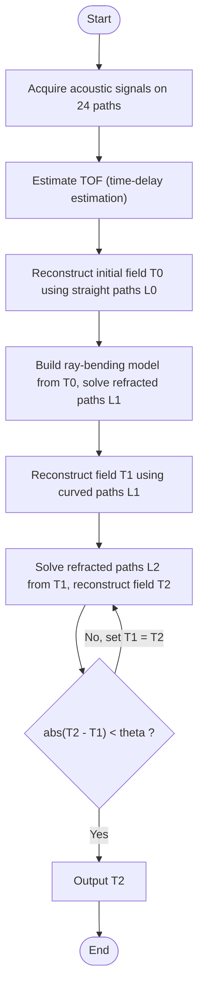
```mermaid
flowchart TD
    A([Start]) --> B["Acquire acoustic signals on 24 paths"]
    B --> C["Estimate TOF (time-delay estimation)"]
    C --> D["Reconstruct initial field T0 using straight paths L0"]
    D --> E["Build ray-bending model from T0, solve refracted paths L1"]
    E --> F["Reconstruct field T1 using curved paths L1"]
    F --> G["Solve refracted paths L2 from T1, reconstruct field T2"]
    G --> H{"abs(T2 - T1) &lt; theta ?"}
    H -- "No, set T1 = T2" --> G
    H -- Yes --> I["Output T2"]
    I --> J([End])
```

<p align="center">
  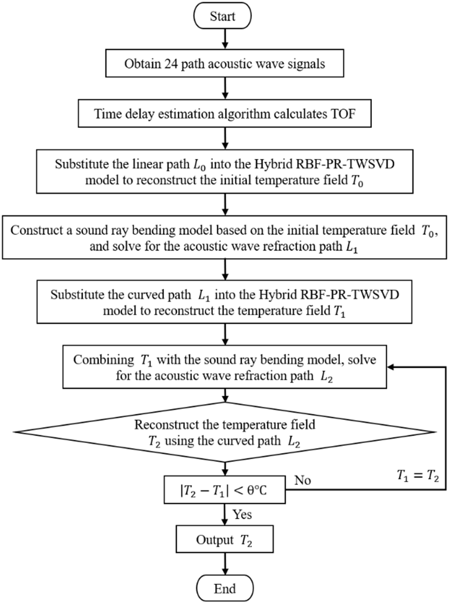
</p>
<p align="center"><em>Fig. 1  Temperature field reconstruction process (from TOF input to temperature inversion output).</em></p>

---

## 3. Simulation Setup

| Item | Setting |
| :-- | :-- |
| Boiler cross-section | 24 m × 24 m (8 transducers A-H); 32 m × 24 m (10 transducers A-J) |
| Effective acoustic paths | 24 |
| Wall temperature points | 8 (wall thermocouples, at 1/3 and 2/3 of each side) |
| Grid division | Fine grid 4 × 4 (Gaussian RBF centers), coarse grid 2 × 2 (IMQ RBF centers) |
| Sound source | White noise, 500 Hz - 2000 Hz, sampling rate 10 kHz, 10 000 samples |
| Delay / attenuation | 500-sample delay, attenuation coefficient 0.2; reference signal SNR 7 dB, delayed signal SNR -7 dB |
| TOF perturbation | $t = t\times(1+\beta N_{noise})$, $\beta\in[0,0.1]$; result tables are given at $\beta=3\%$ |
| Metrics | $E_{max}$ (K), $E_{mean}$ (%), $E_{rms}$ (%), central-zone $E_a$ (%), boundary-zone $E_b$ (%) |

**Theoretical temperature field models** (benchmarks used for the reconstruction comparison):

- 24 m × 24 m, unimodal skewed

$$
T(x,y)=800+\frac{600}{0.015\left[(x-15)^2+(y-15)^2\right]+1}
$$

- 24 m × 24 m, bimodal skewed

$$
T(x,y)=800+\frac{420}{0.018\left[(x-18)^2+(y-15)^2\right]+1}+\frac{360}{0.015\left[(x-6)^2+(y-9)^2\right]+1}
$$

- 32 m × 24 m, unimodal skewed

$$
T(x,y)=800+\frac{600}{0.018\left[(x-20)^2+(y-15)^2\right]+1}
$$

- 32 m × 24 m, bimodal skewed

$$
T(x,y)=800+\frac{360}{0.015\left[(x-20)^2+(y-8)^2\right]+1}+\frac{420}{0.018\left[(x-10)^2+(y-16)^2\right]+1}
$$

<p align="center">
  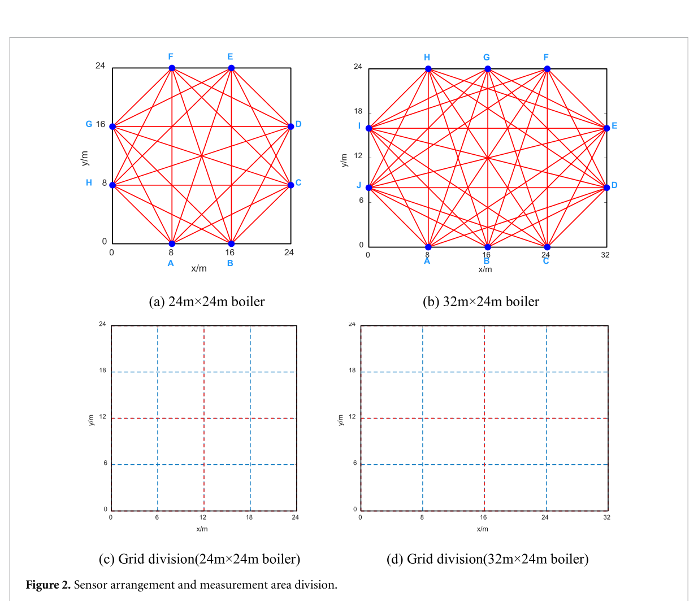
</p>
<p align="center"><em>Fig. 2  Sensor arrangement (a, b) and measurement area division (c, d).</em></p>

### 3.1 Cross-correlation time-delay estimation

At low SNR, spurious peaks appear in the cross-correlation function and obscure the primary peak,
which easily leads to time-delay misidentification. The paper introduces an attenuation factor to
suppress the noise interference of peak localization, making the primary peak sharper and its position
more accurate.

<p align="center">
  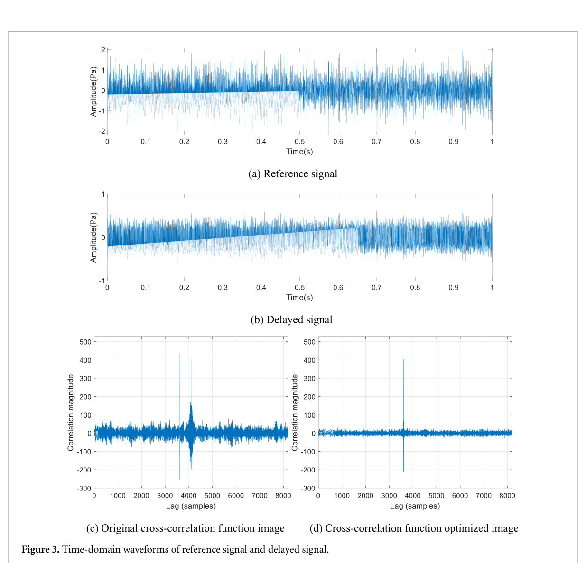
</p>
<p align="center"><em>Fig. 3  Time-domain waveforms of the reference/delayed signals and the cross-correlation function before and after optimization.</em></p>

---

## 4. Simulation Results

### 4.1 Reconstruction error comparison (beta = 3%)

**Table 1. Algorithm reconstruction error (24 m × 24 m boiler, $\beta$ = 3%)**

| Model | Method | $E_{max}$ (K) | $E_{mean}$ (%) | $E_{rms}$ (%) | $E_a$ (%) | $E_b$ (%) |
| :-- | :-- | --: | --: | --: | --: | --: |
| Unimodal skewness | LSM-SVD | -288.63 | 6.76 | 8.73 | 4.53 | 7.50 |
| Unimodal skewness | RBF-PR-SVD | -823.981 | 8.37 | 13.47 | 4.25 | 9.74 |
| Unimodal skewness | RBF-PR-TSVD | -526.076 | 4.89 | 7.35 | 2.73 | 5.61 |
| Unimodal skewness | RBF-PR-TWSVD | -285.658 | 3.33 | 4.67 | 2.23 | 3.70 |
| Unimodal skewness | Hybrid RBF-PR-TWSVD | 149.46 | 2.74 | 3.66 | 2.03 | 2.97 |
| Unimodal skewness | **Hybrid RBF-PR-TWSVD with refraction** | **49.37** | **1.80** | **2.12** | **2.01** | **1.68** |
| Bimodal skewness | LSM-SVD | -277.95 | 5.65 | 7.14 | 3.60 | 6.33 |
| Bimodal skewness | RBF-PR-SVD | 767.499 | 8.06 | 11.29 | 4.73 | 9.17 |
| Bimodal skewness | RBF-PR-TSVD | -418.808 | 6.48 | 8.82 | 3.38 | 7.51 |
| Bimodal skewness | RBF-PR-TWSVD | -281.432 | 6.25 | 7.99 | 2.62 | 7.13 |
| Bimodal skewness | Hybrid RBF-PR-TWSVD | 155.08 | 4.68 | 5.66 | 2.92 | 5.27 |
| Bimodal skewness | **Hybrid RBF-PR-TWSVD with refraction** | **-80.78** | **1.62** | **2.01** | **1.58** | **1.64** |

**Table 2. Algorithm reconstruction error (32 m × 24 m boiler, $\beta$ = 3%)**

| Model | Method | $E_{max}$ (K) | $E_{mean}$ (%) | $E_{rms}$ (%) | $E_a$ (%) | $E_b$ (%) |
| :-- | :-- | --: | --: | --: | --: | --: |
| Unimodal skewness | LSM-SVD | 203.78 | 4.60 | 5.72 | 2.69 | 5.24 |
| Unimodal skewness | RBF-PR-SVD | -948.52 | 6.71 | 11.09 | 6.19 | 6.88 |
| Unimodal skewness | RBF-PR-TSVD | -364.27 | 4.60 | 6.63 | 3.41 | 4.99 |
| Unimodal skewness | RBF-PR-TWSVD | -188.70 | 3.62 | 4.59 | 4.41 | 3.36 |
| Unimodal skewness | Hybrid RBF-PR-TWSVD | -129.25 | 2.48 | 3.05 | 3.10 | 2.28 |
| Unimodal skewness | **Hybrid RBF-PR-TWSVD with refraction** | **-97.02** | **1.78** | **2.37** | **1.56** | **1.85** |
| Bimodal skewness | LSM-SVD | 265.26 | 5.10 | 7.24 | 2.57 | 5.94 |
| Bimodal skewness | RBF-PR-SVD | -594.37 | 6.21 | 9.30 | 2.11 | 7.57 |
| Bimodal skewness | RBF-PR-TSVD | -279.78 | 5.05 | 6.83 | 2.39 | 5.94 |
| Bimodal skewness | RBF-PR-TWSVD | -174.36 | 3.50 | 4.42 | 2.47 | 3.84 |
| Bimodal skewness | Hybrid RBF-PR-TWSVD | 116.07 | 3.03 | 4.01 | 2.03 | 3.60 |
| Bimodal skewness | **Hybrid RBF-PR-TWSVD with refraction** | **-77.55** | **1.95** | **2.32** | **1.29** | **1.93** |

**Key findings**

- The conventional LSM-SVD and RBF-PR-SVD methods produce severely underestimated temperatures near
  the walls (reconstructed values as low as 500-600 K, with errors of 500-800 K).
- Introducing the hybrid RBF model reduces the maximum error from about 500 K to about 200 K;
  adding the wall-temperature constraint further reduces it to within 100 K.
- **With the refraction effect included**, the global error generally falls below 40-80 K and every
  metric becomes optimal, with the most pronounced improvement in the boundary zone $E_b$.

<details>
<summary><b>Fig. 4 / Fig. 5 — 24 m × 24 m boiler reconstruction results (6 methods compared)</b></summary>

<p align="center">
  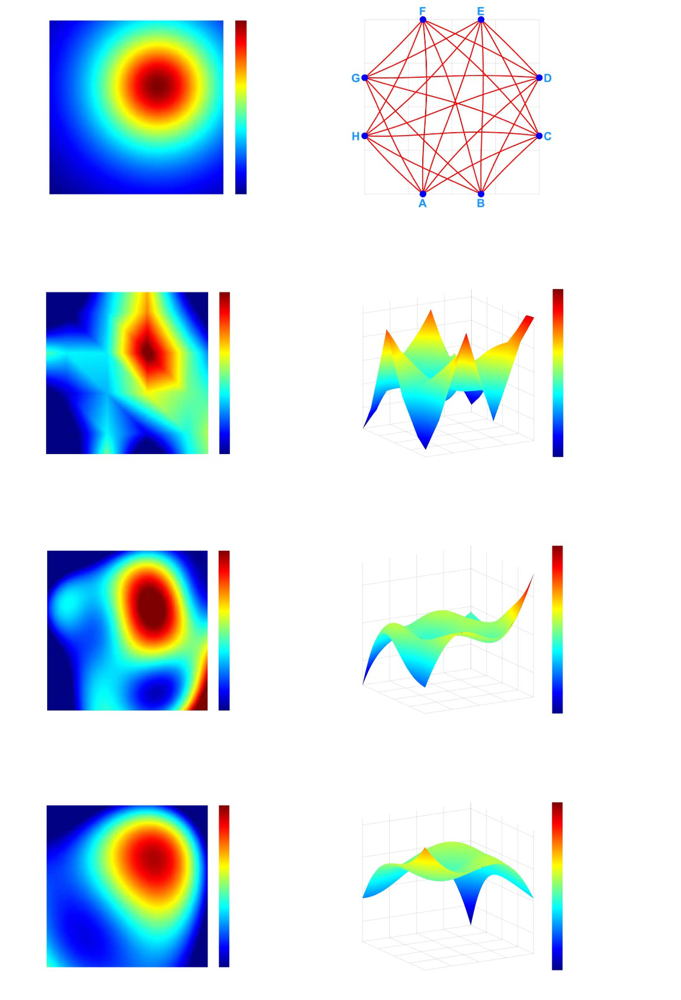
</p>
<p align="center">
  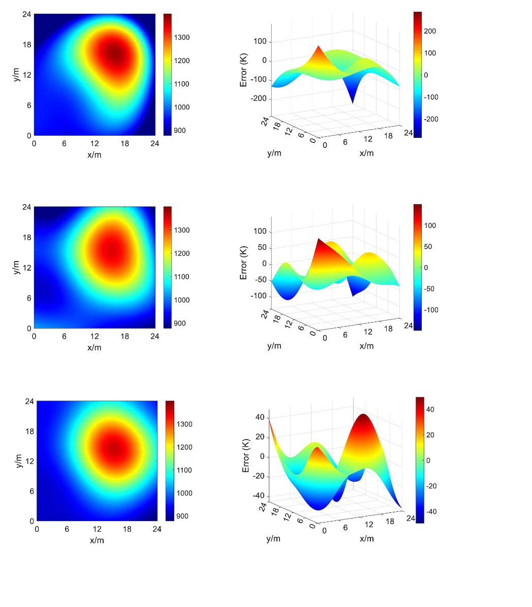
</p>
<p align="center"><em>Fig. 4  Reconstruction results of the unimodal skewed model (24 m × 24 m boiler): (a) theoretical field, (b) refraction-corrected paths, (c)-(h) six algorithms.</em></p>

<p align="center">
  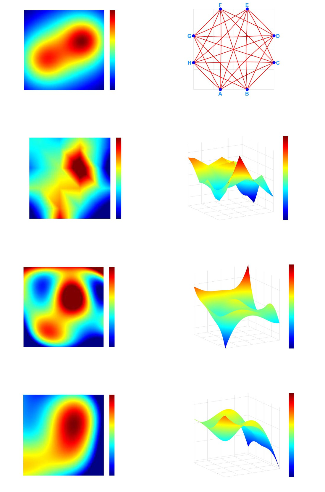
</p>
<p align="center">
  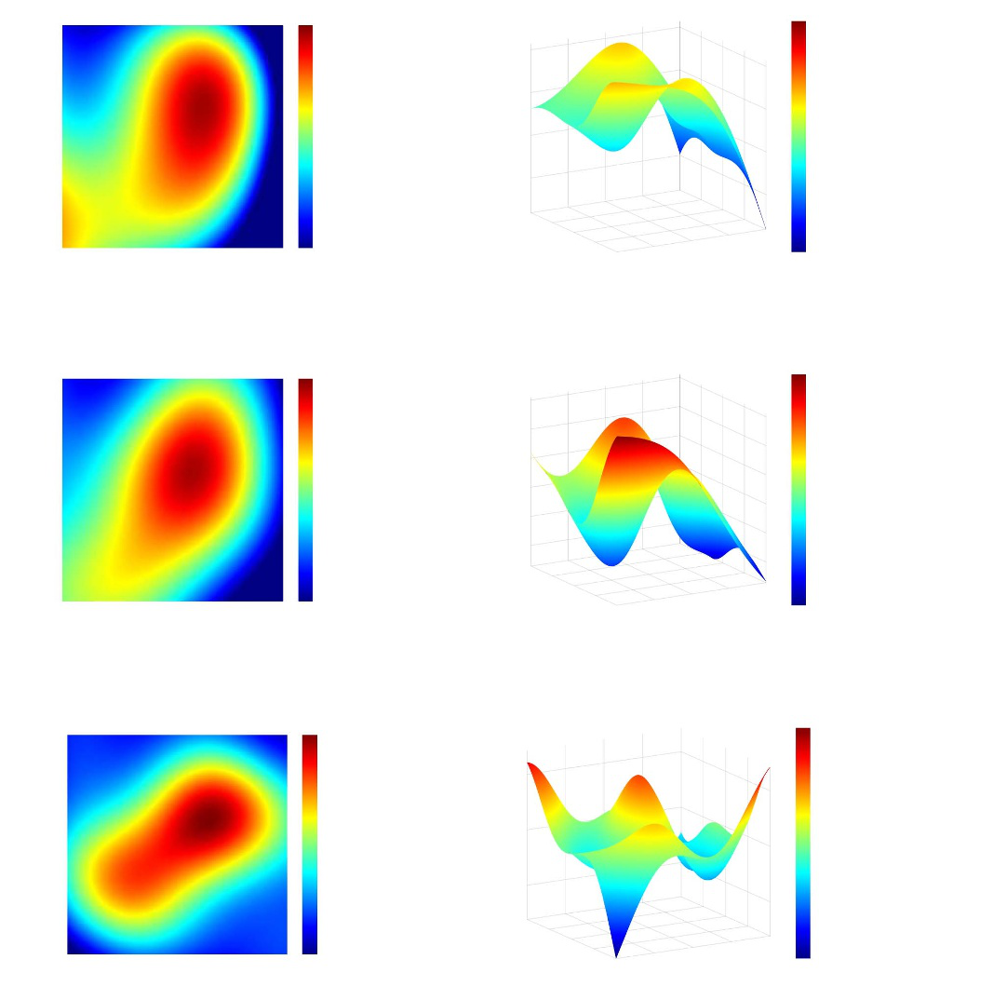
</p>
<p align="center"><em>Fig. 5  Reconstruction results of the bimodal skewed model (24 m × 24 m boiler).</em></p>

</details>

<details>
<summary><b>Fig. 6 / Fig. 7 — 32 m × 24 m boiler reconstruction results</b></summary>

<p align="center">
  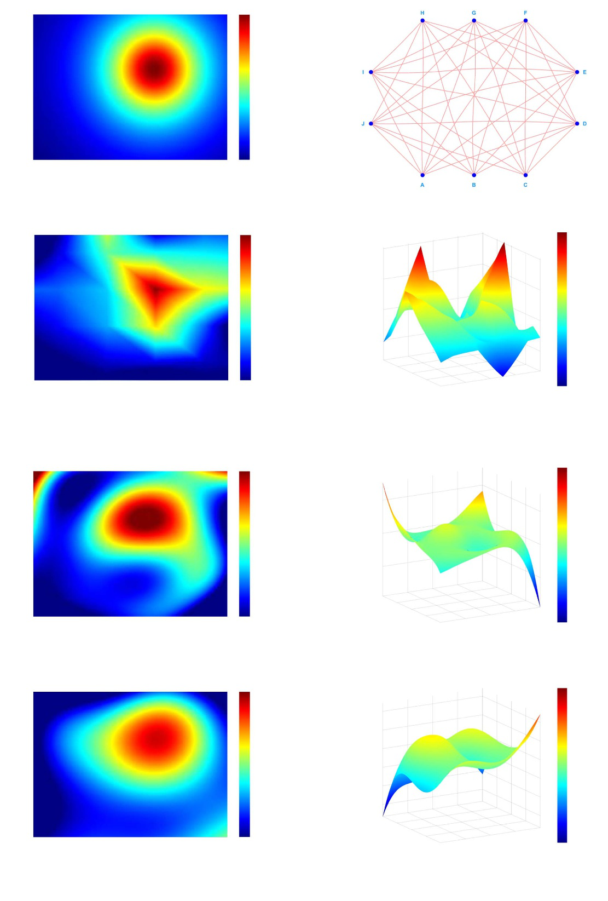
</p>
<p align="center">
  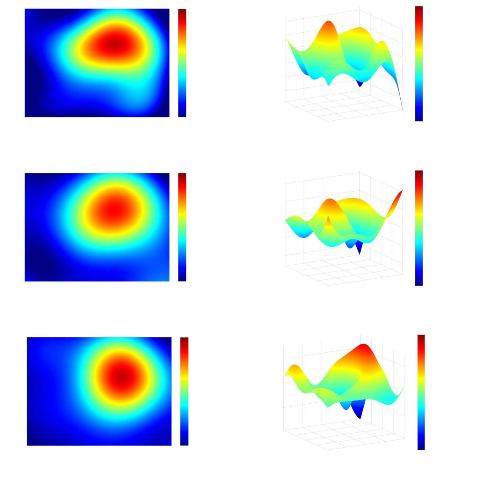
</p>
<p align="center"><em>Fig. 6  Reconstruction results of the unimodal skewed model (32 m × 24 m boiler).</em></p>

<p align="center">
  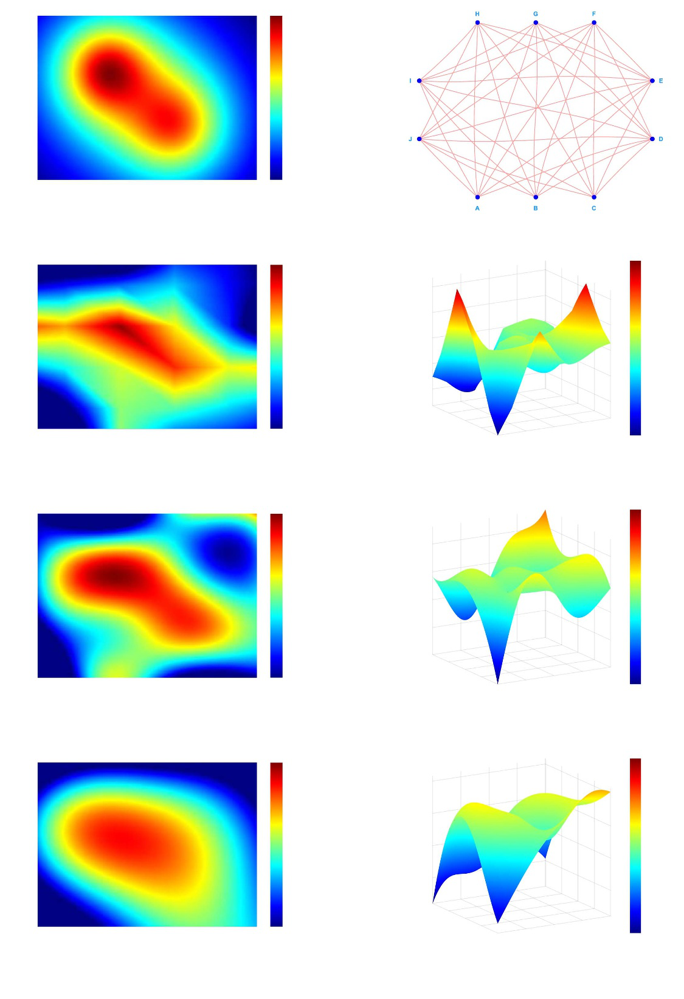
</p>
<p align="center"><em>Fig. 7  Reconstruction results of the bimodal skewed model (32 m × 24 m boiler).</em></p>

</details>

### 4.2 Selection of the wall-temperature regularization parameter

<p align="center">
  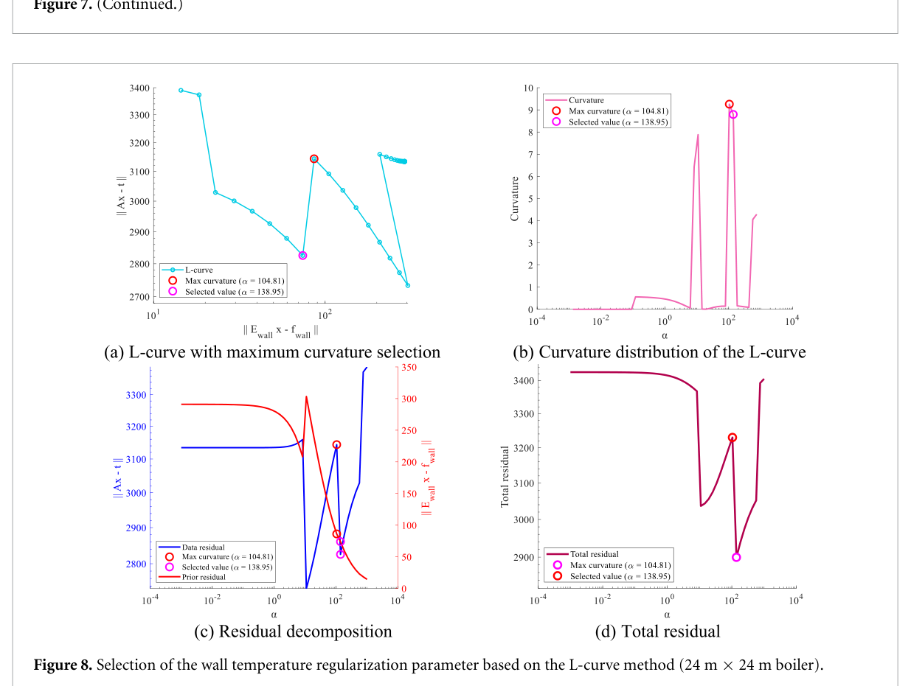
  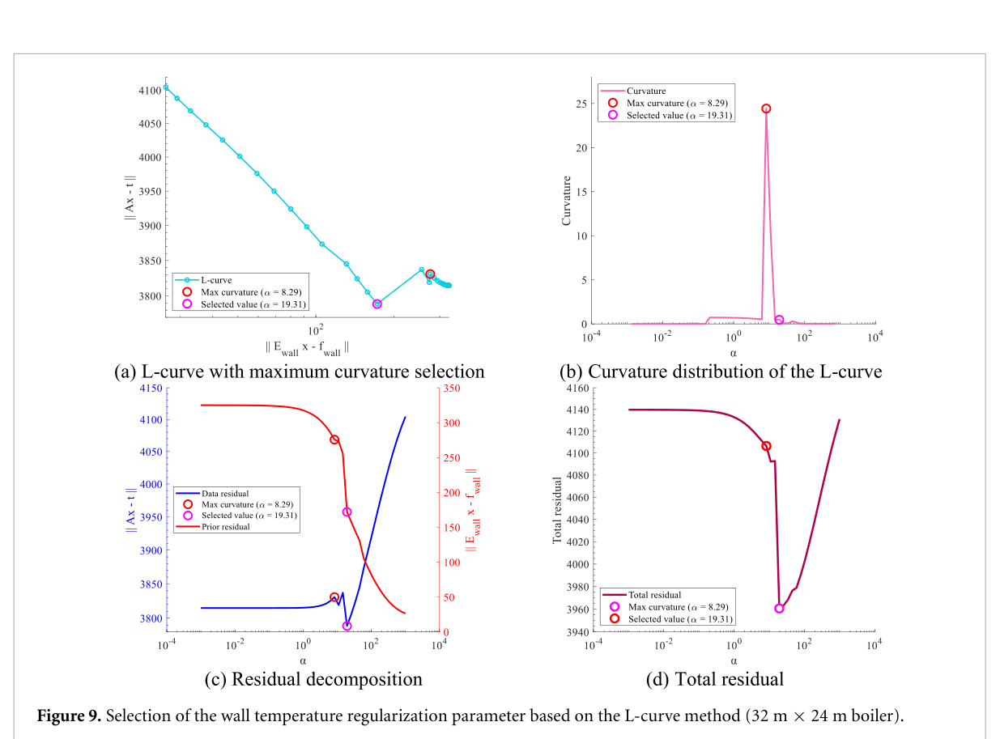
</p>
<p align="center"><em>Fig. 8 / Fig. 9  Selection of the wall-temperature regularization parameter using the L-curve method (top: 24 m × 24 m, bottom: 32 m × 24 m).</em></p>

This criterion requires **no prior knowledge of the theoretical temperature field**, so it can be
directly applied in the field, guaranteeing a consistent parameter-selection procedure between the
numerical simulations and the engineering experiments.

### 4.3 Noise robustness

<p align="center">
  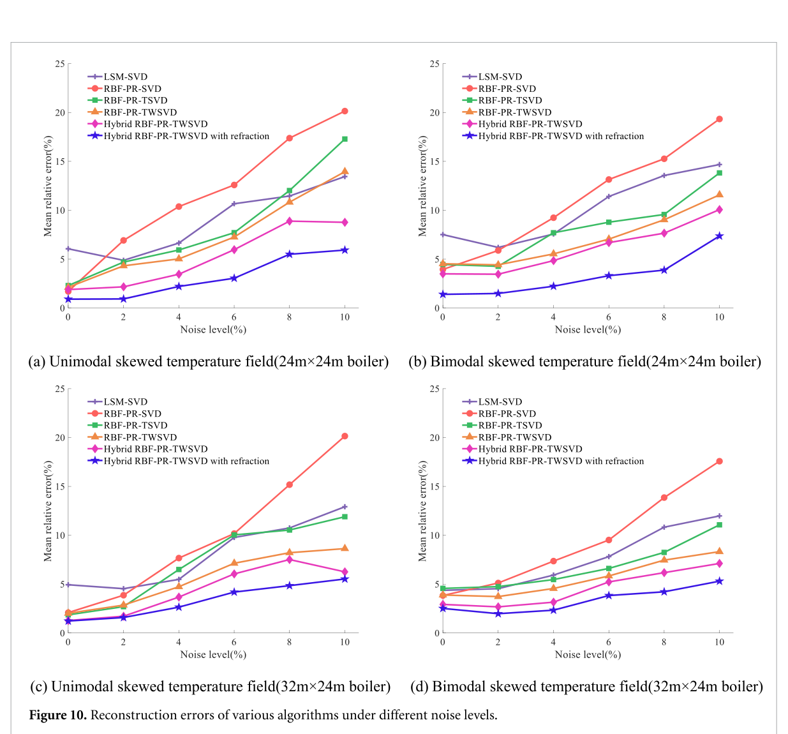
</p>
<p align="center"><em>Fig. 10  Average relative error curves of the various algorithms under different noise levels.</em></p>

The Hybrid RBF-PR-TWSVD method with refraction correction achieves the lowest error at all noise
levels, exhibiting the best noise-resistant stability.

---

## 5. Citation

If you find this work helpful for your research, please consider citing:

> Zhigang Feng, Qifei Li, "Design of an acoustic thermometry system based on time-delay estimation optimization and hybrid radial basis function temperature field reconstruction," *Meas. Sci. Technol.*, vol. 37, no. 25, art. no. 255901, Jun. 2026, doi: [10.1088/1361-6501/ae7a9e](https://doi.org/10.1088/1361-6501/ae7a9e).

```bibtex
@article{Feng_2026,
  doi       = {10.1088/1361-6501/ae7a9e},
  url       = {https://doi.org/10.1088/1361-6501/ae7a9e},
  year      = {2026},
  month     = {jun},
  publisher = {IOP Publishing},
  volume    = {37},
  number    = {25},
  pages     = {255901},
  author    = {Feng, Zhigang and Li, Qifei},
  title     = {Design of an acoustic thermometry system based on time-delay estimation optimization and hybrid radial basis function temperature field reconstruction},
  journal   = {Measurement Science and Technology},
  abstract  = {Power plant boiler furnace temperature field distribution is key to constructing strategy control and safeguard monitoring. Existing acoustic-based boiler temperature field reconstruction methods suffer from missing boundary information and predominantly rely on straight-line assumptions for acoustic paths, resulting in severe distortion of the reconstructed results. At low signal-to-noise ratios, the calculation of cross-correlation delay is subject to pseudo peak interference, and the acoustic delay position is prone to errors, thereby affecting the reliable calculation of acoustic time of flight. Thus, a temperature field reconstruction method is proposed for real combustion condition in boiler. To solve noise separation, an attenuation factor is introduced to suppress the noise interference of peak localization in cross-correlation calculation. Moreover, in view of the acoustic ray refraction effect, this paper proposes a hybrid radial basis function model combined with polynomial reproduction (Hybrid RBF-PR) for temperature field reconstruction, which incorporates wall temperature constraints into the model equations through trust factors to achieve regularized solutions. The simulation results indicate that this method significantly reduces reconstruction errors in boundary regions while maintaining the accuracy of overall temperature distribution trends. Currently, this solution has been implemented in the boiler of Unit #2 at Shaanxi Fugu Power Plant. Experimental tests confirm that the solution can accurately characterize the temperature distribution under various operating conditions, demonstrating the engineering applicability of the temperature field reconstruction method. This holds substantial application value and economic significance for power plant safety operations and combustion strategy formulation.}
}
```

---

*This README was compiled from the original `Readme.txt` and the paper. The figures under
`figures/` were auto-cropped from the paper PDF by `tools/render_figures.py`; copyright remains
with the original authors and IOP Publishing.*
